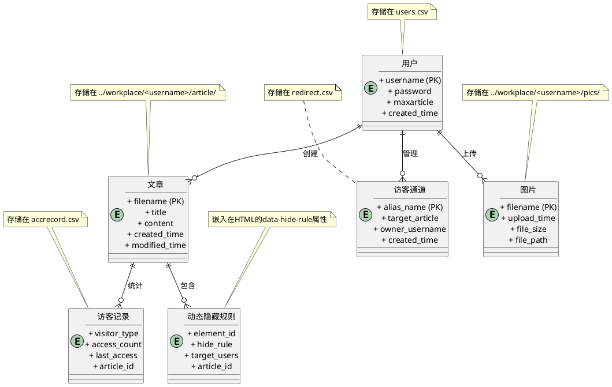
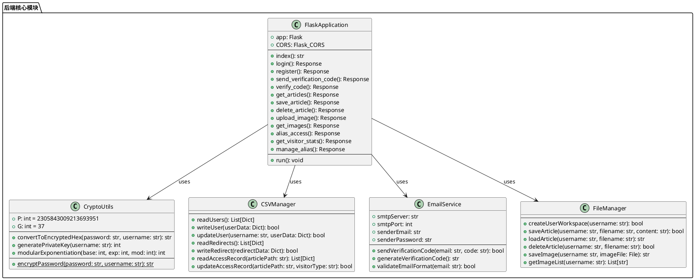
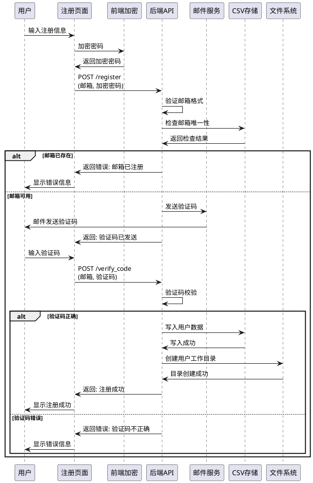
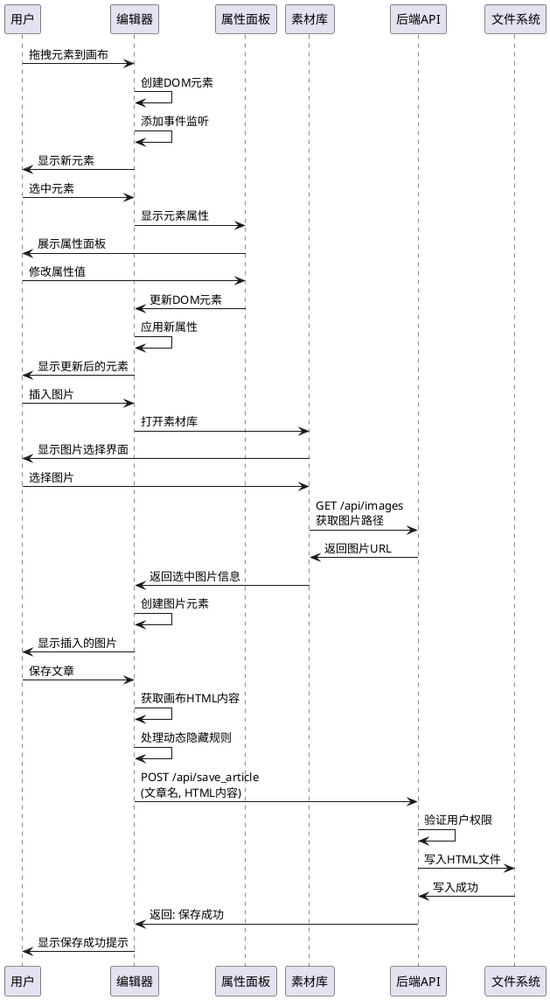
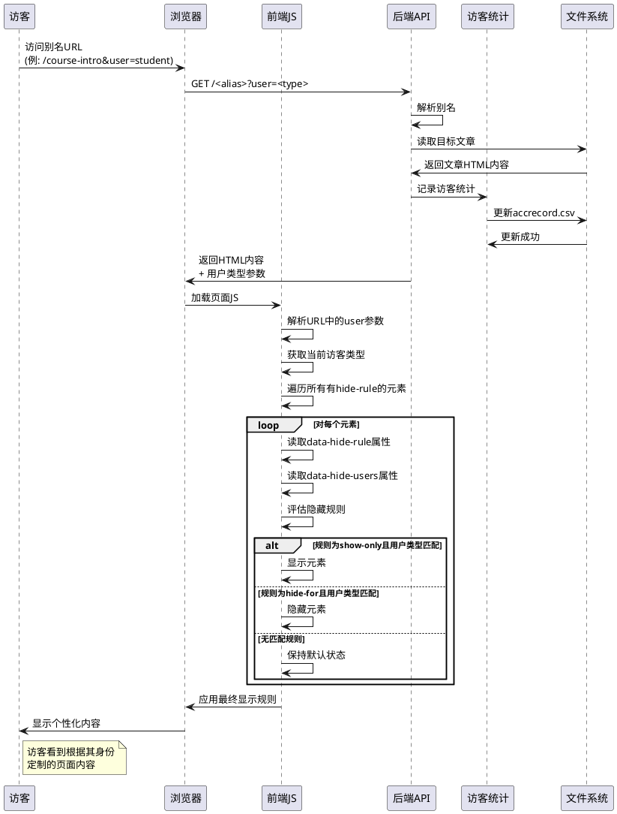
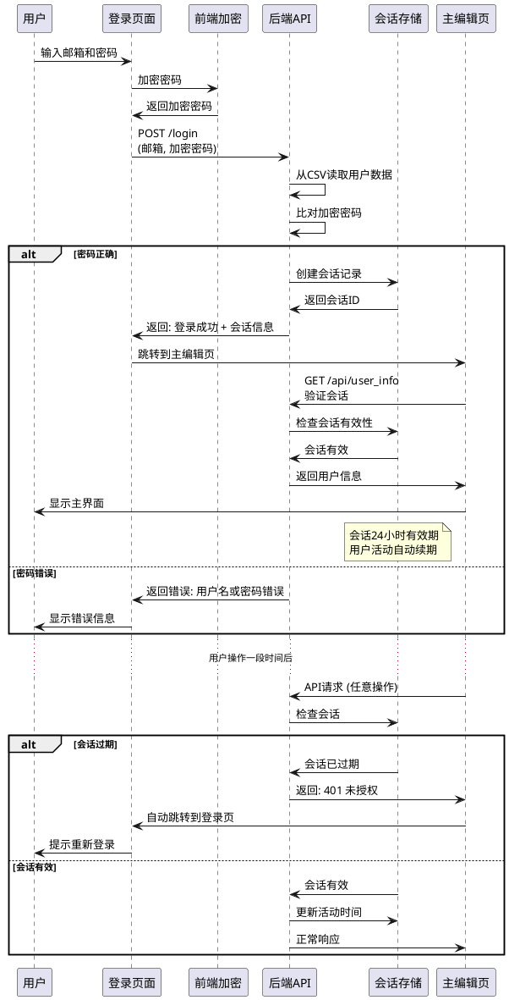

# Schomepage主页生成系统 - UML建模图

**项目名称**: Schomepage主页生成系统  
**开发团队**: 潘旭, 韦先轶, 刘远巍  
**文档版本**: v1.0 (2025年6月)

---

## 1. 实体关系图（ER图）

使用PlantUML语法绘制的实体关系图：

## 2. 类图（Class Diagram）

### 2.1 后端类图

### 2.2 前端类图

```plantuml
@startuml Schomepage_Frontend_Classes
package "前端核心模块" {
    
    class AuthManager {
        +currentUser: string
        +sessionToken: string
        +loginTime: Date
        --
        +loginUser(email: str, password: str): Promise<boolean>
        +logoutUser(): void
        +checkLoginState(): boolean
        +requireAuth(): void
        +refreshSession(): void
        +isSessionValid(): boolean
    }
    
    class EditorManager {
        +canvas: HTMLElement
        +selectedElement: HTMLElement
        +undoStack: Array<State>
        +redoStack: Array<State>
        +maxUndoSteps: number
        --
        +initializeEditor(): void
        +addTextElement(x: number, y: number): void
        +addImageElement(imageSrc: str, x: number, y: number): void
        +addShapeElement(shapeType: str, x: number, y: number): void
        +selectElement(element: HTMLElement): void
        +deleteElement(element: HTMLElement): void
        +updateElementProperty(property: str, value: any): void
        +moveElement(element: HTMLElement, deltaX: number, deltaY: number): void
        +saveArticle(articleName: str): Promise<void>
        +loadArticle(articleName: str): Promise<void>
        +undo(): void
        +redo(): void
        +saveState(): void
    }
    
    class CryptoService {
        +P: number = 2305843009213693951
        +G: number = 37
        --
        +convertToEncryptedHex(password: str, username: str): string
        +generatePrivateKey(username: str): number
        +modularExponentiation(base: number, exp: number, mod: number): number
    }
    
    class DynamicHideManager {
        +currentUserType: string
        +hideRules: Map<string, HideRule>
        --
        +parseUserFromURL(): string
        +applyHideRules(): void
        +setElementHideRule(element: HTMLElement, rule: str, users: str): void
        +removeHideRule(element: HTMLElement): void
        +evaluateHideRule(rule: str, userType: str, targetUsers: str): boolean
        +updateVisibility(element: HTMLElement, visible: boolean): void
    }
    
    class MaterialManager {
        +backgroundImages: Array<string>
        +iconLibrary: Array<string>
        +userImages: Array<string>
        --
        +loadBackgroundImages(): Promise<Array<string>>
        +loadIconLibrary(): Promise<Array<string>>
        +loadUserImages(): Promise<Array<string>>
        +uploadUserImage(file: File): Promise<string>
        +deleteUserImage(filename: str): Promise<boolean>
        +insertMaterial(type: str, src: str): void
    }
    
    class ArticleManager {
        +articleList: Array<Article>
        +currentArticle: Article
        --
        +getArticleList(): Promise<Array<Article>>
        +createNewArticle(name: str): Promise<boolean>
        +openArticle(filename: str): Promise<void>
        +deleteArticle(filename: str): Promise<boolean>
        +renameArticle(oldName: str, newName: str): Promise<boolean>
        +getArticleInfo(filename: str): Article
    }
    
    class AliasManager {
        +aliasList: Array<Alias>
        --
        +createAlias(aliasName: str, targetArticle: str): Promise<boolean>
        +updateAlias(aliasName: str, newTarget: str): Promise<boolean>
        +deleteAlias(aliasName: str): Promise<boolean>
        +getAliasList(): Promise<Array<Alias>>
        +validateAliasName(name: str): boolean
    }
    
    class VisitorStatsManager {
        --
        +getVisitorStats(articleName: str): Promise<VisitorStats>
        +updateVisitorCount(articleName: str, visitorType: str): void
        +exportStatsData(articleName: str): Promise<string>
    }
}

' 关系定义
AuthManager --> CryptoService : uses
EditorManager --> DynamicHideManager : contains
EditorManager --> MaterialManager : uses
EditorManager --> ArticleManager : uses
ArticleManager --> AliasManager : uses
ArticleManager --> VisitorStatsManager : uses

' 数据传输对象
class Article {
    +filename: string
    +title: string
    +content: string
    +createdTime: Date
    +modifiedTime: Date
}

class Alias {
    +aliasName: string
    +targetArticle: string
    +ownerUsername: string
    +createdTime: Date
}

class VisitorStats {
    +visitorType: string
    +accessCount: number
    +lastAccess: Date
}

class HideRule {
    +ruleType: string
    +targetUsers: Array<string>
}

@enduml
```

## 3. 顺序图（Sequence Diagram）

### 3.1 用户注册流程

### 3.2 文章编辑与保存流程

### 3.3 动态隐藏模块访问流程

### 3.4 用户登录与会话管理流程

---

## 使用说明

这些UML图表使用PlantUML语法编写，可以通过以下方式查看：

1. **在线查看**: 复制代码到 [PlantUML在线编辑器](http://www.plantuml.com/plantuml/uml/)
2. **VS Code插件**: 安装"PlantUML"插件，直接在编辑器中预览
3. **生成图片**: 使用PlantUML工具生成PNG/SVG格式图片

### 图表说明

- **ER图**: 展示了系统数据模型和实体间关系，基于CSV文件存储结构设计
- **类图**: 分别展示了后端Flask应用和前端JavaScript模块的类结构设计
- **顺序图**: 详细描述了用户注册、文章编辑、动态隐藏访问、登录会话等核心业务流程

这些图表为Schomepage系统的架构理解、代码维护和功能扩展提供了重要的参考文档。 